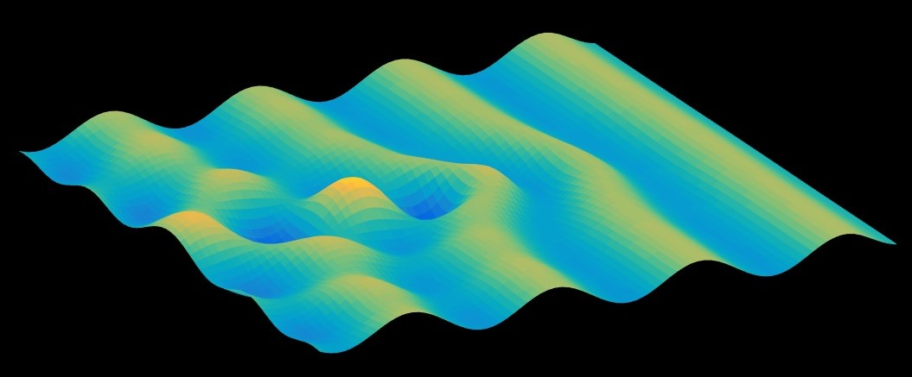

## MATLAB code to simulate non-dispersive wave propagating over a varying bottom

The main code is wave_2D_on_obstacle.m

Can change the parameters of the waves/obstacles in the appropriate separate functions.

